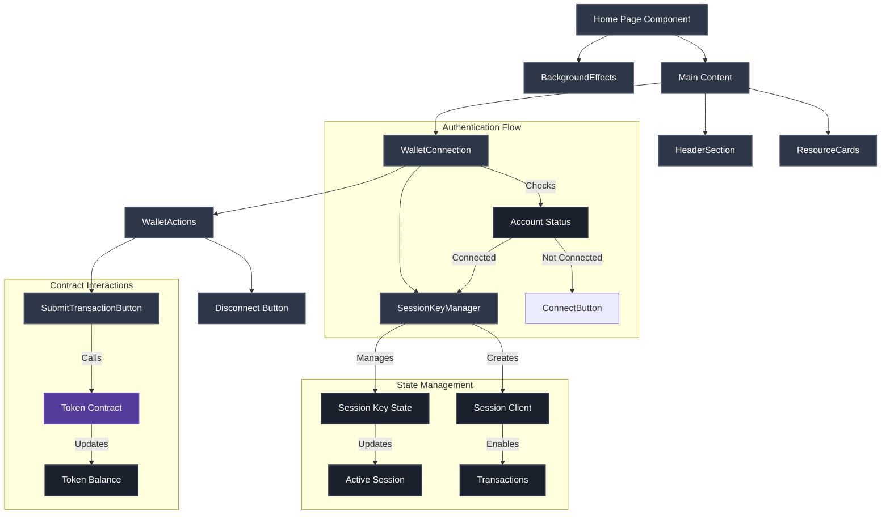

The provided code integrates RainbowKit with Abstract's Global Wallet (AGW) in a Next.js application, enabling users to:
- Connect their AGW
- Create a session key for the AGW sponsored by the Abstract Paymaster
- Sponsored mint ERC20 tokens without manual approval for each transaction due to the session keys
   - See the [Contract source code here](https://github.com/rookmate/testing-abstract-erc20-zksync/blob/main/src/SimpleToken.sol)
   - Deployed on Abstract Testnet to [`0x29015fde8cB58126E17e5Ac46bb306a1D7339B59`](https://explorer.testnet.abs.xyz/address/0x29015fde8cB58126E17e5Ac46bb306a1D7339B59)
- Revoke the session key for the AGW sponsored by the Abstract Paymaster
- Disconnect their AGW

### Key takeaways

- Leverage [`useCreateSession`](https://docs.abs.xyz/abstract-global-wallet/agw-react/hooks/useCreateSession) React hook to create a session key for the connected Abstract Global Wallet.
- Where you decide to create and store
  ```tsx
  const sessionPrivateKey =  generatePrivateKey();
  ```
  will dictate if your application will generate different private keys or always the same.
	- In my implementation I chose to generate new private keys every time but you may want to keep the same.
	- There is usefulness in maintaining the same address as you may fetch the session key data from `0xEcC560d914c6710f0d7920ff8424060b86448DF8` since the event `SessionCreated` and `SessionRevoked` will let you know if your application has active sessions for that user.
	- I stored the session in the browser `localStorage` in plain text for this example repository as it makes it easier to debug and visualize the information. Consider more secure options for your application.
- Both the `createSessionAsync` and `revokeSessionsAsync` can be sponsored transactions if you add the paymaster details. See the [Line 103](https://github.com/rookmate/testing-agw-rainbowkit-nextjs/blob/main/src/app/page.tsx#L103) and [Line 171](https://github.com/rookmate/testing-agw-rainbowkit-nextjs/blob/main/src/app/page.tsx#L171) of `page.tsx`.
- Sessions can be tailored to your application and focused in scope. For instance, in this example ([Line 112](https://github.com/rookmate/testing-agw-rainbowkit-nextjs/blob/main/src/app/page.tsx#L112)) I only allow mint calls to my ERC20 token.
   - To deploy your own zkSync solidity contract just follow [these steps](https://docs.abs.xyz/build-on-abstract/smart-contracts/foundry) as you will need to use the foundry-zksync fork.

### Application Flow


### Detailed implementation steps:

1. Set Up the Abstract Global Wallet with RainbowKit ([original instructions](https://github.com/Abstract-Foundation/examples/blob/main/agw-rainbowkit-nextjs/README.md))

    This example showcases how to use the Abstract Global Wallet react SDK with [RainbowKit](https://www.rainbowkit.com/) inside a [Next.js](https://nextjs.org/) application.

    1. Get a copy of the `agw-rainbowkit-nextjs` example directory from the Abstract Examples repository:

       ```bash
       mkdir -p agw-rainbowkit-nextjs && curl -L https://codeload.github.com/Abstract-Foundation/examples/tar.gz/main | tar -xz --strip=2 -C agw-rainbowkit-nextjs examples-main/agw-rainbowkit-nextjs && cd agw-rainbowkit-nextjs
       ```

    2. Install dependencies

       ```bash
       npm install
       ```

    3. Run the development server

       ```bash
       npm run dev
       ```

      Visit [http://localhost:3000](http://localhost:3000) to see the app.

2. Implement Session Key Creation:
   - After user login, utilize AGW's session key API to create a session key with permissions for token minting
   - Store the session key
   - For detailed guidance, refer to [Abstract's documentation on session keys](https://docs.abs.xyz/abstract-global-wallet/agw-client/session-keys/overview)

3. Mint ERC20 Tokens Using the Session Key:
   - Set up a function to interact with the ERC20 contract's minting function
   - Use the session key to sign and send the mint transaction on behalf of the user
